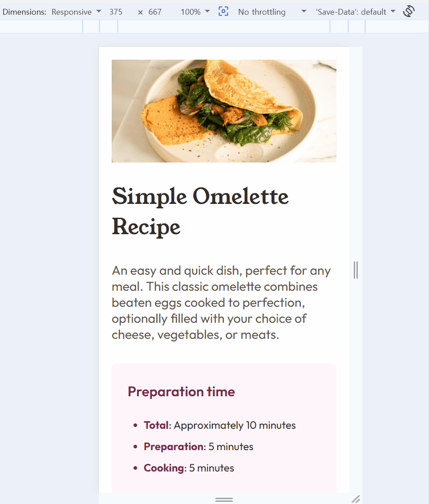
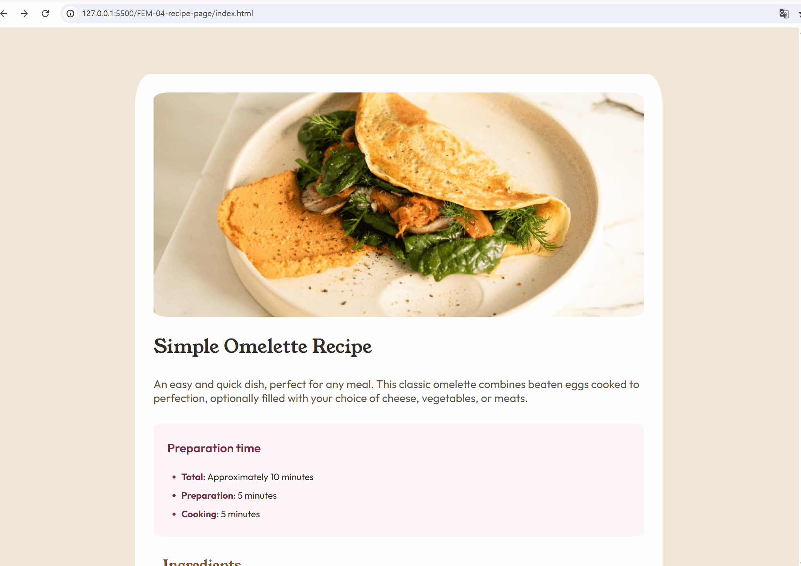

# Frontend Mentor - Recipe page solution

This is a solution to the [Recipe page challenge on Frontend Mentor](https://www.frontendmentor.io/challenges/recipe-page-KiTsR8QQKm). Frontend Mentor challenges help you improve your coding skills by building realistic projects.

## Table of contents

- [Overview](#overview)
  - [The challenge](#the-challenge)
  - [Screenshot](#screenshot)
  - [Links](#links)
- [My process](#my-process)
  - [Built with](#built-with)
  - [What I learned](#what-i-learned)
  - [Continued development](#continued-development)
  - [Useful resources](#useful-resources)
  - [AI Collaboration](#ai-collaboration)
- [Author](#author)

## Overview

### Screenshot

### Links

- Solution URL: [Add solution URL here](https://github.com/SuaJeong-winter/FEM-04-recipe-page)
- Live Site URL: [Add live site URL here](https://suajeong-winter.github.io/FEM-04-recipe-page/)

## My process

### Built with

- Semantic HTML5 markup
- CSS custom properties
- Flexbox
- Mobile-first workflow

### What I learned

- 모바일 퍼스트 웹 개발을 고려- 하며 CSS와 HTML을 설계했습니다. I designed the HTML and CSS with mobile-first web development in mind.
- 미디어쿼리를 사용하는 것을 연습했다. I practiced implementing responsive layouts using media queries.
- scroll() 함수를 사용했다. I used scroll()
- 이전에 받은 피드백들 반영 (태그보다는 클래스 선택자, BEM naming, 스크린리더를 고려한 alt,,,,etc)

### Continued development

좀 더 responsive한 화면을 만들예정.

### Useful resources

- [mdn docs](https://developer.mozilla.org/en-US/) - Almost bible while developing

### AI Collaboration

- What tools did you use (e.g., ChatGPT, Claude, GitHub Copilot)? ChatGPT, Github Copilot
- How did you use them (e.g., debugging, generating boilerplate, brainstorming solutions)? Debugging, Questioning etc.
- What worked well? What didn't? It worked well as always

## Author

- Website - [정수아Jeong Sua](https://github.com/SuaJeong-winter)
- Frontend Mentor - [@SuaJeong-winter](https://www.frontendmentor.io/profile/SuaJeong-winter)
